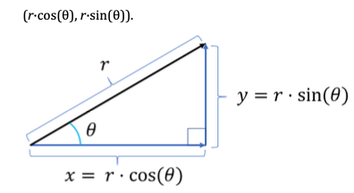

# Maths

Notes and experiments in maths.

## Vectors

Vector arithmetic is implemented in [vector.py](./vector.py). Usage and notes are in [the vector notebook](./vectors.ipynb).

## Angles and Trig

